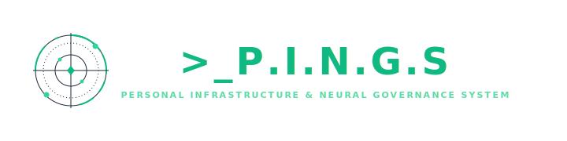
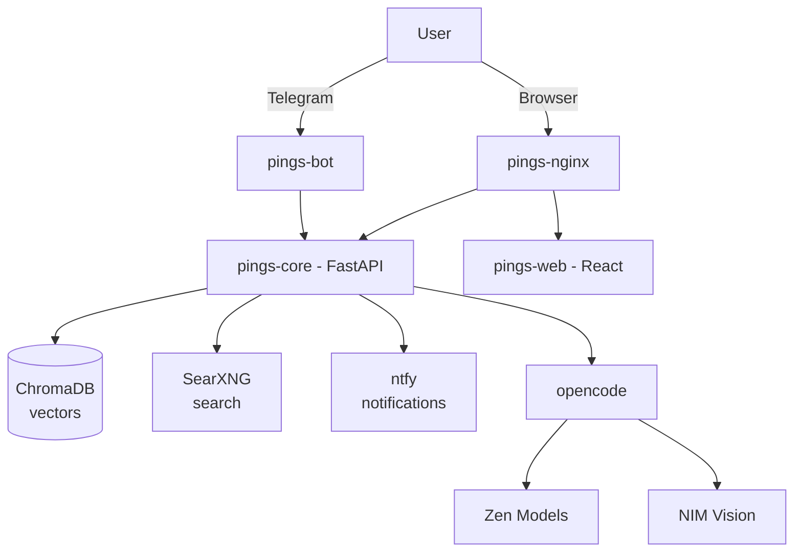

<div align="center">



A self-hosted AI assistant platform combining a Telegram bot, FastAPI brain, vector memory, web search, and a React dashboard — all orchestrated with Docker.


</div>

---

## 📋 Table of Contents

- [Features](#-features)
- [Architecture](#-architecture)
- [Quick Start](#-quick-start)
- [Telegram Bot Commands](#-telegram-bot-commands)
- [Deep Research Pipeline](#-deep-research-pipeline)
- [HomeLab Management](#-homelab-management)
- [Project Structure](#-project-structure)
- [Configuration](#-configuration)
- [API Endpoints](#-api-endpoints)
- [Tech Stack](#-tech-stack)
- [License](#-license)

---

## ✨ Features

| | |
|---|---|
| 🤖 **Telegram Bot** | Chat, upload photos/documents, switch AI models, run research queries, view/clear history |
| 🧠 **AI Brain (FastAPI)** | Intent classification, agent dispatch, conversation memory |
| 🔬 **Deep Research** | Multi-section research pipeline with source gathering, failure detection, and retry logic |
| 💬 **Research Discussion** | Ask follow-up questions about completed research directly in the web UI |
| 🖥️ **Host Execution** | Run shell commands, create folders, and manage files on the host machine via SSH |
| 🏠 **HomeLab Management** | Start, stop, pause, and restart Docker containers from the web dashboard |
| 🎭 **Zen AI Models** | 5 selectable models via opencode (MiMo V2.5, DeepSeek V4, Nemotron 3, Big Pickle, North Mini) |
| 👁️ **Vision Support** | NVIDIA NIM for image analysis |
| 🗂️ **Vector Memory** | ChromaDB for semantic search over conversation history |
| 🔍 **Web Search** | SearXNG self-hosted search engine |
| 🔔 **Notifications** | ntfy for alerts and research completion |
| 📊 **Web Dashboard** | React frontend with chat, research, history, and homelab views |
| 🔒 **Reverse Proxy** | nginx with TLS, rate limiting, WebSocket support |
| 🎙️ **Persona System** | Configurable AI personality and safety rules |

---

## 🏗️ Architecture



---

## 🚀 Quick Start

### Prerequisites
- Docker 24+
- Docker Compose v2
- A Telegram bot token (from `@BotFather`)
- SSH key configured on the host machine (for host commands)

### 1. Clone and configure
```bash
git clone https://github.com/devwithsujay/P.I.N.G.S-Personal-Infrastructure-Neural-Governance-System.git
cd pings-core-v2
cp .env.example .env
# Edit .env with your API keys
```

### 2. Run setup
```bash
chmod +x scripts/setup.sh
./scripts/setup.sh
```

### 3. Access

| Service | URL |
|---------|-----|
| Web Dashboard | http://localhost |
| API | http://localhost:8002 |
| SearXNG | http://localhost:8081 |
| ChromaDB | http://localhost:8100 |
| ntfy | http://localhost:8090 |

### 4. Start chatting
Open Telegram, find your bot, and send `/start`.

---

## 🤖 Telegram Bot Commands

| Command | Description |
|---------|-------------|
| `/start` | Show welcome message and usage info |
| `/history` | View last 20 messages from your session |
| `/clear` | Delete your session history |
| `research about <topic>` | Start deep research on a topic |

---

## 🔬 Deep Research Pipeline

The research system performs multi-section analysis with:

1. **Topic Decomposition** — Breaks research into logical sections
2. **Source Gathering** — Searches SearXNG and DuckDuckGo for each section
3. **Section Writing** — Concurrent LLM calls with failure detection and retry
4. **Assembly** — Combines sections with proper spacing and metadata
5. **Quality Checks** — Cross-section contradiction detection, word count validation

> [!NOTE]
> Automatic retry uses exponential backoff (2s → 4s → 8s → 16s), maximum 4 call attempts per section. Failed sections are retried in isolation during assembly; a `SectionGenerationError` is raised if any section fails after all retries.

**Report formatting**
- Sections separated by horizontal rules (`---`)
- Paragraph breaks normalized for consistent rendering
- Telegram-safe dividers (Unicode box-drawing chars) for bot delivery

---

## 🏠 HomeLab Management

Access the HomeLab tab in the web dashboard to:

- View all running Docker containers
- Start, stop, pause, and restart containers
- Monitor container health status
- View container port mappings

---

## 📁 Project Structure

<details>
<summary>Click to expand full tree</summary>

```
pings-core-v2/
├── bot/                    # Telegram bot (aiogram)
│   ├── main.py            # Bot handlers, research polling, report delivery
│   ├── requirements.txt
│   └── Dockerfile
├── core/                   # FastAPI backend
│   ├── main.py            # API endpoints, container management
│   ├── agents/
│   │   ├── router.py      # Intent classification, host/research dispatch
│   │   ├── research.py    # Deep research pipeline
│   │   └── opencode_engine.py  # LLM integration
│   ├── tools/
│   │   ├── browser.py     # Web search, content fetching
│   │   ├── host.py        # SSH-based host execution
│   │   ├── ssh.py         # SSH command runner
│   │   └── system.py      # Container management (start/stop/pause/restart)
│   └── memory/
│       └── db.py          # SQLite database
├── web/                    # React frontend
│   └── src/
│       ├── pages/
│       │   ├── Chat.jsx          # Chat interface
│       │   ├── ResearchPage.jsx  # Research & discussion
│       │   ├── History.jsx       # Session history viewer
│       │   └── HomeLab.jsx       # Container management
│       └── context/
│           └── ChatContext.jsx   # Chat state, history loading
├── nginx/                  # Reverse proxy config
│   └── nginx.conf
├── searxng/                # Search engine config
│   └── settings.yml
├── persona/                # AI persona files
│   ├── IDENTITY.md
│   ├── CONTEXT.md
│   ├── RULES.md
│   └── JOURNAL.md
├── docker-compose.yml
├── .env.example
├── .gitignore
└── README.md
```

</details>

---

## ⚙️ Configuration

All configuration is done via environment variables in `.env`. See [`.env.example`](.env.example) for the full list.

**Key variables**

| Variable | Description |
|---|---|
| `TELEGRAM_BOT_TOKEN` | Your bot token |
| `TELEGRAM_ALLOWED_USER_ID` | Your Telegram user ID (for access control) |
| `BRAIN_SECRET_KEY` | Auto-generated |
| `DEFAULT_ZEN_MODEL` | Starting AI model (default: `opencode/mimo-v2.5-free`) |

> [!WARNING]
> Do not change `BRAIN_SECRET_KEY` after first run.

---

## 🔌 API Endpoints

<details>
<summary>Click to expand full API reference</summary>

### Chat
- `POST /chat` — Send message, get AI response
- `POST /chat/upload` — Upload file with message

### Research
- `POST /research/start` — Start quick/balanced research
- `POST /research/deep` — Start deep research pipeline
- `POST /research/discuss` — Ask follow-up about research
- `GET /research/runs` — List all research runs
- `GET /research/runs/{id}` — Get run status and report
- `GET /research/{id}/report.html` — View HTML report

### Host Commands
- `POST /host/command` — Execute shell command on host
- `POST /host/mkdir` — Create directory on host
- `POST /host/rm` — Delete file/directory on host
- `POST /host/ls` — List directory contents on host

### HomeLab
- `GET /homelab/containers` — List all containers
- `POST /homelab/containers/{name}/action` — Start/stop/pause/restart

### History
- `GET /sessions` — List all sessions
- `GET /sessions/{id}` — Get session messages
- `DELETE /history` — Clear all history
- `DELETE /history/{id}` — Clear specific session

</details>

---

## 🛠️ Tech Stack

| Layer | Technology |
|-------|-----------|
| Bot | Python 3.11, aiogram 3 |
| Backend | Python 3.11, FastAPI, SQLite |
| AI | Zen AI (opencode), NVIDIA NIM |
| Vector DB | ChromaDB |
| Search | SearXNG |
| Notifications | ntfy |
| Frontend | React, Vite |
| Proxy | nginx (Alpine) |
| Containers | Docker Compose |

---

## 📄 License

Private — for personal use only.
