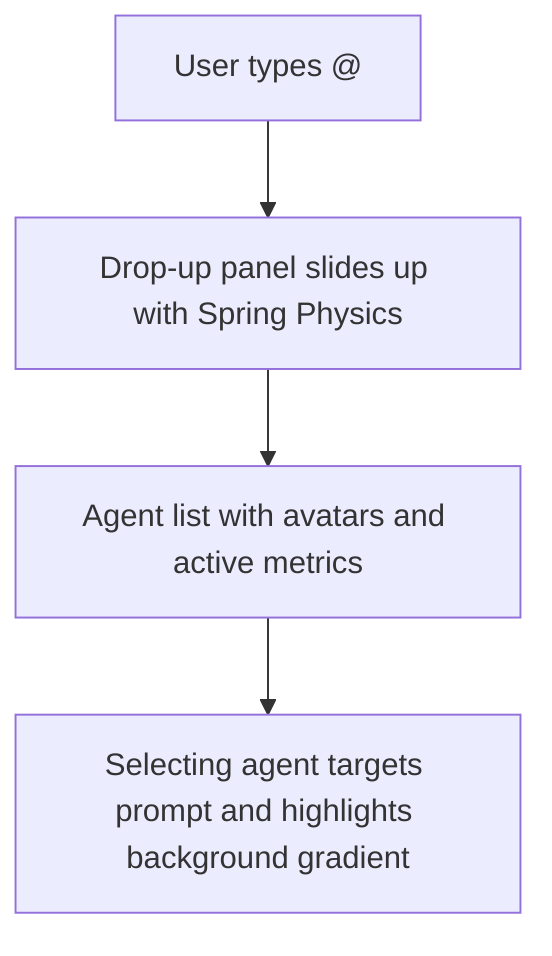

# UI/UX Modernization & Improvement Plan

This document outlines a comprehensive design strategy and technical roadmap to modernize the **P.I.N.G.S Core v2** dashboard. The goal is to elevate it from a basic functional interface into a premium, state-of-the-art "Neural Governance Console" that matches the aesthetic of high-end AI platforms like Claude, Gemini, and Vercel.

---

## 🎨 1. Core Visual System & Foundation

The current styling relies on static values and a limited palette of Tailwind custom colors coupled with simple CSS properties. We can inject high-end aesthetics by rewriting the design tokens and layout rules in [index.css](file:///c:/Users/sujay/Downloads/SideQuest/pings-core-v2/web/src/index.css).

### 🌌 Accent Palette & Theme Engine
Instead of just an accent color selector in the settings, we should transition to a full-fledged **Theme Engine** providing multi-dimensional modes:
*   **Theme Presets:** 
    *   `Cyberpunk / Neural Mesh` (High-contrast dark, glowing purple/neon accents)
    *   `Steel Minimalist` (Monochromatic slate gray, crisp white accents, muted dark panels)
    *   `Synthwave Aurora` (Vaporwave dark, magenta/cyan gradient overlays)
    *   `Operator Light` (Clean paper white, indigo accents, subtle gray borders)
*   **Aesthetic Formula:** Use color mixing and opacity states to derive soft highlights, borders, and shadows dynamically:
    ```css
    :root {
      --accent-rgb: 108, 92, 231;
      --accent: rgb(var(--accent-rgb));
      --accent-glow: rgba(var(--accent-rgb), 0.15);
      --bg-base: #0a0a0c;
      --bg-surface: #121217;
      --border-glow: rgba(var(--accent-rgb), 0.12);
    }
    ```

### ✨ Enhanced Glassmorphism & Borders
Modern glassmorphism relies on subtle gradient borders and soft, layered box shadows instead of harsh, single-colored borders.
```css
.glass {
  background: rgba(18, 18, 23, 0.65);
  backdrop-filter: blur(16px);
  -webkit-backdrop-filter: blur(16px);
  border: 1px solid rgba(255, 255, 255, 0.05);
  box-shadow: 0 4px 30px rgba(0, 0, 0, 0.4);
}

/* Premium gradient borders for cards and modals */
.glass-glow-border {
  position: relative;
  background: rgba(18, 18, 23, 0.8);
  border-radius: 12px;
}
.glass-glow-border::before {
  content: '';
  position: absolute;
  inset: 0;
  border-radius: 12px;
  padding: 1px;
  background: linear-gradient(to bottom right, rgba(var(--accent-rgb), 0.3), transparent 70%, rgba(255, 255, 255, 0.05));
  -webkit-mask: linear-gradient(#fff 0 0) content-box, linear-gradient(#fff 0 0);
  mask: linear-gradient(#fff 0 0) content-box, linear-gradient(#fff 0 0);
  -webkit-mask-composite: xor;
  mask-composite: exclude;
  pointer-events: none;
}
```

### ⚡ Animation Layer
Move from standard duration/timing transitions to modern physics-like curves:
```css
.spring-transition {
  transition: all 0.4s cubic-bezier(0.175, 0.885, 0.32, 1.275);
}
```

---

## 💬 2. Component-by-Component Blueprint

### 🗨️ The Chat Console ([Chat.jsx](file:///c:/Users/sujay/Downloads/SideQuest/pings-core-v2/web/src/pages/Chat.jsx))
The current chat view has a simple feed and a boxy text input area. We can turn this into a premium focus-mode workspace:

1.  **Dynamic Autogrow Input:** Replace the static textarea with one that grows dynamically with context line breaks up to `150px` before introducing scrollbars, avoiding awkward visual jumps.
2.  **Message Action Bars:** Hovering over a message should fade in quick controls:
    *   *User messages:* "Edit prompt", "Copy text".
    *   *Agent messages:* "Copy markdown", "Regenerate response", "Bookmark context".
3.  **Code block enhancement:**
    *   Insert a utility bar above every syntax-highlighted block indicating the language type (e.g., Python, Javascript).
    *   Include a "Copy Code" button with visual feedback (a temporary "Copied!" checkmark state).
4.  **Agent Suggestions Menu:** Modernize the `@` agent dropdown. Use cards containing agent avatars, colored online indicator dots, active workload statistics, and descriptions instead of simple text lists.



---

### 🔍 Research Control & Reader ([ResearchPage.jsx](file:///c:/Users/sujay/Downloads/SideQuest/pings-core-v2/web/src/pages/ResearchPage.jsx))
Research is a central feature of the P.I.N.G.S brain. The UI handles multiple research modes but displays the report inside a plain iframe or basic markdown panel.

1.  **Animated Sliding Capsule Tabs:** Replace the report tab buttons with an animated segmented control containing a sliding capsule background indicator.
2.  **Modernized Source Ledger:**
    *   Format sources as grid-based cards.
    *   Integrate Favicons (e.g., via `https://www.google.com/s2/favicons?domain=...`) and metadata indicators showing content type (PDF, Wiki, News, Tech Spec).
    *   Add a visual indicator of search domain distribution.
3.  **Interactive Report Sidecar Panel:** Let users click on inline citation numbers `[1]` in the report to open a slide-out drawer containing a preview of that source directly inside the viewport.

---

### 📊 Mission Control Dashboard ([MissionControl.jsx](file:///c:/Users/sujay/Downloads/SideQuest/pings-core-v2/web/src/pages/MissionControl.jsx))
This page is currently text-heavy, relying on basic card layouts for status, logs, and memory search. We should elevate it to a real-time command center:

1.  **Dynamic Status & Metric Graphs:**
    *   Show CPU/Memory/Disk status using SVG circular progress gauge dials with glowing stroke tracks.
    *   Add active pulse markers to agent run lists so running processes visually blink and animate.
2.  **Agent Network Visualizer (Mermaid/SVG):**
    *   Render a lightweight interactive network node map representing the available agents, their system prompts, and memory linkages.
3.  **Interactive Journal Feed:**
    *   Add event-type icons next to logs.
    *   Allow users to filter log events by severity or agent scope with micro-badge filters.

---

### 🗓️ Smart Scheduler & Board ([Calendar.jsx](file:///c:/Users/sujay/Downloads/SideQuest/pings-core-v2/web/src/pages/Calendar.jsx) & [Tasks.jsx](file:///c:/Users/sujay/Downloads/SideQuest/pings-core-v2/web/src/pages/Tasks.jsx))
The scheduler and Kanban board are highly functional but visually standard.

1.  **Tasks Board Drag Enhancements:**
    *   Introduce dynamic CSS transforms when cards are dragged (e.g., slight rotate `3deg` and scale `1.02` with shadow blur changes during drag).
    *   Add visual drop-zone outlines that glow when hovered over with a dragged item.
2.  **Modern Calendar Grid:**
    *   Include weather forecast symbols or task density heat maps directly in day cells.
    *   Add visual color tags matching task priorities.
    *   Transition day selection views into sliding modal sheets on mobile devices.

---

### ⚙️ Systems & Persona Console ([Settings.jsx](file:///c:/Users/sujay/Downloads/SideQuest/pings-core-v2/web/src/pages/Settings.jsx) & [Skills.jsx](file:///c:/Users/sujay/Downloads/SideQuest/pings-core-v2/web/src/pages/Skills.jsx))
1.  **Model Availability Gages:**
    *   Instead of standard color indicator dots in model settings, use status pills with health indicators ("99ms latency", "Offline", "Active").
2.  **Persona Sandbox Simulator:**
    *   Provide a split-pane interface in the personality tab. Allow users to update their neural persona and immediately run quick test prompts in a sidecar chat sandbox to verify changes instantly.

---

## 🛠️ 3. Execution Roadmap & Steps

Here is the structured roadmap to execute these improvements:

```markdown
- [ ] Phase 1: Global Theme & Layout
    - [ ] Set up theme variables in CSS base
    - [ ] Create premium glass styles and border animations
    - [ ] Add spring-based cubic-bezier utility rules
- [ ] Phase 2: Core Chat Modernization
    - [ ] Implement autogrow chat textarea
    - [ ] Add markdown code block utility bars and copy action
    - [ ] Redesign agent suggestion menu
- [ ] Phase 3: Research Page Refactoring
    - [ ] Build capsule tab indicator component
    - [ ] Modernize Source ledger grid with favicons
    - [ ] Implement inline citation drawer
- [ ] Phase 4: Mission Control Visuals
    - [ ] Create circular SVG system progress meters
    - [ ] Build dynamic live metrics graphs
    - [ ] Add multi-filter badges to event log lists
```

---
> [!TIP]
> Prioritize **Phase 1** first. Since CSS classes in [index.css](file:///c:/Users/sujay/Downloads/SideQuest/pings-core-v2/web/src/index.css) apply globally, establishing the correct theme tokens and glassmorphism utilities makes component-level visual upgrades seamless.
